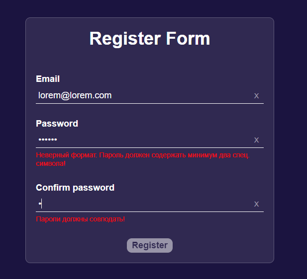

# React Form Practice

Это репозиторий для практики реализации валидации формы с использованием React, Vite, TypeScript и styled-components.

## Стек технологий

<p>
  
  
  
  
</p>

## Описание

В данном проекте представлена форма с тремя полями:
- Email
- Пароль
- Подтверждение пароля

### Валидация

- При вводе неправильного значения в поле отображается сообщение об ошибке ниже поля ввода.
- После правильного заполнения всех полей происходит автофокус на кнопку отправки формы.
- Кнопка отправки блокируется при наличии неправильных значений в форме.

## Структура репозитория

Проект содержит две ветки:

- **main**: код без использования библиотек для валидации.
- **new-branch**: код с использованием библиотек [React Hook Form](https://react-hook-form.com/) и [Yup](https://github.com/jquense/yup) для валидации форм.

## Демо

Посмотреть работу формы можно на [GitHub Pages](https://blinklay.github.io/react-form-practice/).

## Скриншот



## Установка

Чтобы запустить проект локально, выполните следующие команды:

```bash
git clone https://github.com/blinklay/react-form-practice.git
cd react-form-practice
npm install
npm run dev
